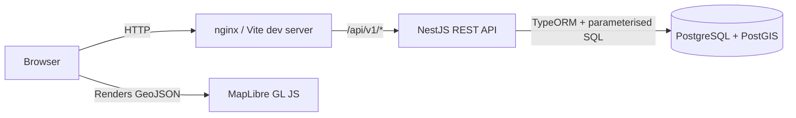

# Architecture

This document describes how the layers fit together, the API request lifecycle,
the map bbox query flow, and the conventions used for state and errors.

## High-Level Topology

The browser never talks to Postgres directly. Every read and write goes
through the API, which enforces validation, paging, and a consistent error
envelope.

## Layered Responsibilities

| Layer | Responsibility |
|-------|----------------|
| Browser / Frontend | Render catalogue, detail, and map. Compose UI. Maintain user preferences and ephemeral UI state via Pinia. Never build SQL. |
| Backend (NestJS) | Validate input, paginate, project entities to DTOs, build parameterised PostGIS queries, normalise errors. |
| Database | Store catalogue rows + features. Enforce spatial constraints via GiST index. |
| nginx | Serve the built assets and proxy `/api/*` to the backend container. In dev, Vite's proxy does the same. |

## API Request Lifecycle

1. Browser calls an HTTP endpoint under `/api/v1/`.
2. The global `RequestIdMiddleware` attaches a request id and echoes it on
   the response.
3. The global `ValidationPipe` validates query / body against the
   controller's DTO classes (`class-validator`) and rejects unknown fields.
4. The route handler delegates to a service module.
5. The service executes a parameterised TypeORM query. SQL never contains
   concatenated user input.
6. The service projects the row(s) to a DTO shape.
7. The controller wraps the DTO in the success envelope
   (`{ data, meta }`) and returns it.
8. The `LoggingInterceptor` writes one structured access line.
9. Any thrown `HttpException` (or unknown error) is funnelled through the
   `AllExceptionsFilter`, which normalises to the error envelope
   (`{ error: { code, message, requestId } }`) and never leaks stack traces
   to clients.

## Map Bbox Query Flow

1. The map view subscribes to `bbox` via the `useMapFeatureQuery` composable.
2. On `moveend`, MapLibre's current bounds are written to the bbox ref.
3. The composable debounces changes (default 250 ms) and uses an
   `AbortController` to cancel any in-flight request.
4. The HTTP call hits `GET /api/v1/datasets/:slug/features`.
5. The backend validates bbox ordering, coordinate ranges, and area ≤ 1.0
   sq deg, then runs the parameterised spatial query and returns a
   `FeatureCollection` with metadata.
6. The composable publishes the features into a ref consumed by `MapView.vue`,
   which re-paints the source / layers.
7. The `mapStore` only stores the **count + status**, not the full feature
   array — keeping the Pinia state serialisable.

## Why the MapLibre Map Instance is Not in Pinia

- The `Map` instance carries DOM bindings (canvas, WebGL context), event
  listeners, and other non-serialisable references.
- Pinia is meant for **serialisable application state**, so a Map instance
  would either break DevTools or cause subtle bugs on hydration.
- All map interactions live in `MapView.vue` (and its composables). Pinia
  only tracks `selectedDatasetSlug`, `selectedFeature`, layer visibility,
  bbox, and feature-loading status.

## Loading / Error / Empty / Success States

Every viewable surface exposes the same five-state contract
(`RequestStatus = 'idle' | 'loading' | 'success' | 'empty' | 'error'`):

- `idle` — no fetch attempted yet.
- `loading` — fetch in flight. The UI shows a spinner.
- `success` — payload returned with items.
- `empty` — request succeeded but no items matched.
- `error` — request failed. The UI shows a retry affordance.

The catalogue and the map feature query each publish this status via their
respective stores so the views can render the appropriate component
(`AppLoading`, `EmptyState`, `AppError`, or the data surface).

## Map Component Boundaries

- `MapView.vue` — owns the `maplibregl.Map` instance, the source, and the
  layers. Cleans up on `onBeforeUnmount`. Exposes `zoomToFeature` to the
  parent.
- `LayerPanel.vue` / `DatasetSelector.vue` — pure UI controls. They emit
  selection and visibility events; the parent (MapView page) owns the state.
- `FeatureDetails.vue` — purely presentational. Receives a feature, emits
  zoom and close events.
- `MapLoadingIndicator.vue` — small floating indicator with a status
  attribute so CSS can colour each state.
- `MobileMapDrawer.vue` — slide-up drawer for the layer panel on small
  screens.

## Component Boundaries — Dataset Surfaces

- `DatasetSearchBar.vue` — debounced input; emits `update:modelValue`.
- `DatasetThemeFilter.vue` — `<select>` of themes; emits `update:modelValue`.
- `DatasetCard.vue` — single catalogue card. Props in, no fetches.
- `DatasetList.vue` — orchestrator that picks the right state component.
- `DatasetMetadata.vue` — single dataset detail; includes the attribute
  schema and the `Open in Map` button.

## Frontend / Backend Type Alignment

- The shared frontend type module lives in `frontend/src/types/index.ts`.
- Backend DTOs mirror the same shape but live in
  `backend/src/{datasets,features}/dto/`.
- The two evolve independently by convention; the API contract is the
  source of truth.

## Why This Architecture Is Reasonable for an MVP

- Strict layering (controller → service → repository) keeps SQL out of
  controllers and validation in one place.
- A single global filter normalises every error path — no `try/catch` in
  controllers.
- The map / catalogue split mirrors the visual split, so the cognitive load
  for new contributors is small.
- The Docker Compose setup is one command, two ports (5173, 3000), and
  one optional DB port for debugging.